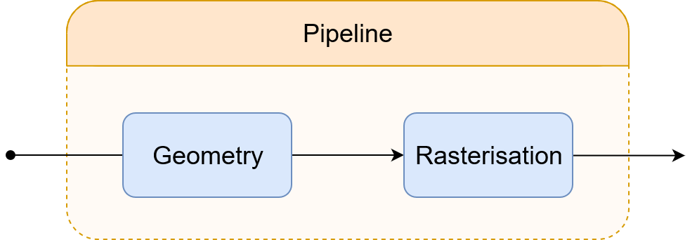

# Graphics pipeline
Adapted from [Wikipedia](https://en.wikipedia.org/wiki/Graphics_pipeline)

The graphics pipeline is a conceptual model to describing the steps
required in rendering a scene to the screen. Most often used in the
case of converting a 3D scene to a 2D screen. \
The steps required for rendering depend on the method that is used
and their implementation may or may not depend on both the method and
the hardware. 

    

The term "pipeline" is used in a similar sense to the pipeline in
processors and it serves a similar purpose. Other than defining the
steps required for rendering, it also enables the creation and usage of
specialized hardware and the parallelization of steps within the
process of rendering.

One general, high level division of the pipeline could be to the steps
of _Geometry_ and _Rasterisation_.

    

The Geometry step would then be responsible for manipulating and
preparing the graphics data for the next step. \
The Resterisation step would be responsible for transforming the data
into the two dimensional image that would then be displayed on screen.